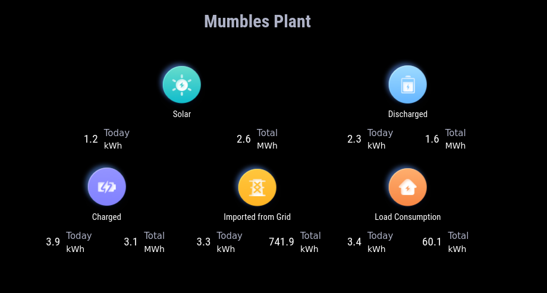

# MMM-Growatt-Stats

A [MagicMirror²](https://magicmirror.builders) module to display Growatt Power Plant Status Data from [Growatt](https://server.growatt.com).

[](LICENSE)



## Dependencies
- [growatt](https://www.npmjs.com/package/growatt)
- Requires MagicMirror² v2.23.0. Built and tested on this version. May work on earlier versions but not tested nor supported.
- Requires that you have an account on [Growatt.com](https://server.growatt.com/login)

## Installation

In your terminal, go to your MagicMirror's Module folder:
````
cd ~/MagicMirror/modules
````

Clone this repository:
````
git clone https://github.com/mumblebaj/MMM-Growatt-Stats.git
````
````
cd MMM-Growatt-Stats
npm install
````

Add the module to the modules array in the `config/config.js` file:
````javascript
        {
            module: "MMM-Growatt-Stats",
            position: "middle_center", //Works best at middle_center. May not display all that well in other positions
            disabled: false,
            config: {
                username: "username",
                password: "password",
                updateInterval: 1000*60*30 //Update every 30 minutes
                
                        }
},
````
 

## CSS Changes
You can apply your own styling for the module. 
- Go to `~/MagicMirror/css` and you can add your styling customizations to the custom.css file.
- In custom.css you can add the following to make the text values bigger

````

.MMM-Growatt-Stats .totalPan.many .val {
    font-size: 1.5vw;
}

.MMM-Growatt-Stats .totalPan .text {
    font-size: 20px;
}

````
- To resize the images, add the following to custom.css

````

.MMM-Growatt-Stats .totalPan .toptext .img {
    width: 75px;
    height: 75px;
}

````

## Updating

To update the module to the latest version, use your terminal to go to your MMM-Growatt-Stats module folder and type the following command:

````
cd MMM-Growatt-Stats
git pull
npm install

````
## Change Log
- 2023/08/07
  - Update module to cater for different Inverter types as the different inverter types return different datasets.
- Update Module version to v2

